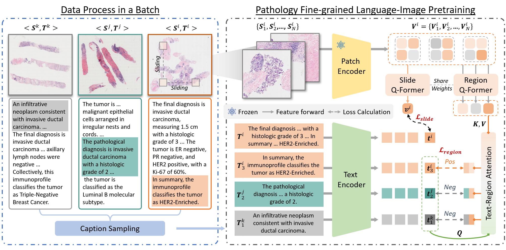

# PathFLIP: Fine-grained Language-Image Pretraining for Versatile Computational Pathology

> 🧬 While Vision-Language Models (VLMs) have achieved notable progress in computational pathology (CPath), the gigapixel scale and spatial heterogeneity of Whole Slide Images (WSIs) continue to pose challenges for multimodal understanding. Existing alignment methods struggle to capture fine-grained correspondences between textual descriptions and visual cues across thousands of patches from a slide, compromising their performance on downstream tasks. In this paper, we propose **PathFLIP** (**Path**ology **F**inegrained **L**anguage-**I**mage **P**retraining), a novel framework for holistic WSI interpretation. PathFLIP decomposes slide-level captions into region-level sub-captions and generates textconditioned region embeddings to facilitate precise visual-language grounding. By harnessing Large Language Models (LLMs), PathFLIP can seamlessly follow diverse clinical instructions and adapt to varied diagnostic contexts. Furthermore, it exhibits versatile capabilities across multiple paradigms, efficiently handling slide-level classification and retrieval, fine-grained lesion localization, and instruction following. Extensive experiments demonstrate that PathFLIP outperforms existing large-scale pathological VLMs on four representative benchmarks while requiring significantly less training data, paving the way for fine-grained, instruction-aware WSI interpretation in research and clinical practice.

<!-- 
 -->

## 🧩 Architecture Overview

